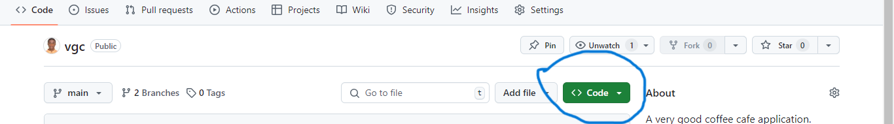
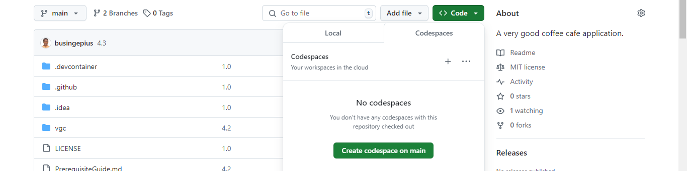
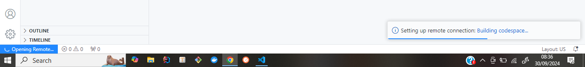
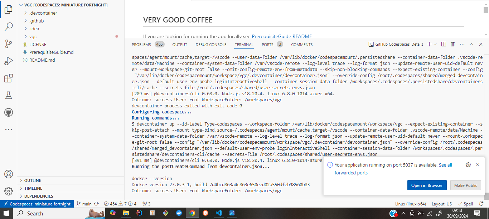

## VERY GOOD COFFEE

If you are looking for running the app locally see [PrerequisiteGuide README](./PrerequisiteGuide.md)

#### To Start the Flutter App in the Github codespace

The necessary `.devcontainer` configuration file is already provided for develoment in containers

1. Click `Code` at the top right of the repo
2. Click the `CodeSpace` tab

3. Click `+` to create a codespace on main

4. Observe the cloud workspace starting up. Note: this process should take around 2 minutes

5. Once it is complete you should be able to view the repo

(./vgc/images/codespaces/image_5.png)

6. Navigate into vgc project folder to run flutter specific commands. Run `cd vgc`

7. Install and update dependencies. Run the `flutter pub get`

#### The Flutter App on the docker container local machine. Follow the steps provided

1. Open the project in a devcontainer and wait for it to set up fully

2. Navigate into vgc project folder to run flutter specific commands. Run `cd vgc`

3. Install and update dependencies. Run the `flutter pub get`

#### The Flutter App on the local machine. Follow the steps provided

- [PrerequisiteGuide README](./PrerequisiteGuide.md)

#### To RUN, TEST, e.t.c., Follow the steps provided

- [Flutter README](./vgc/README.md)
