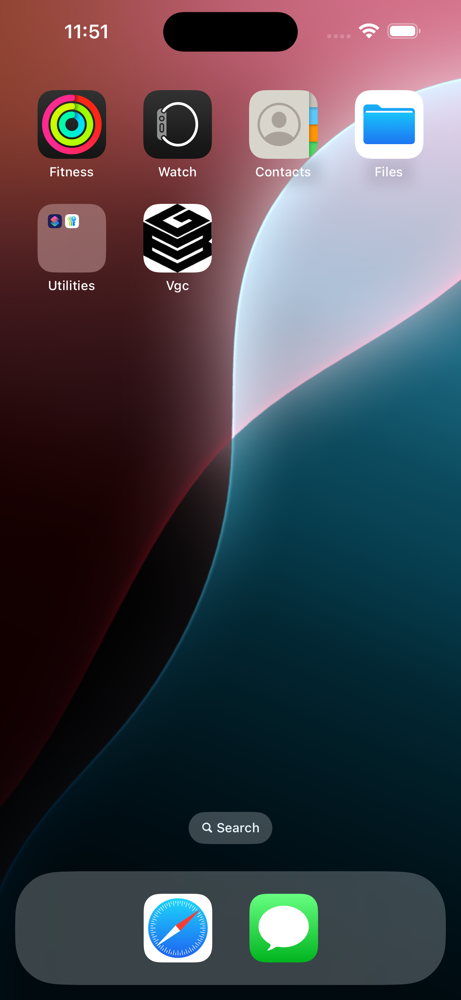

# VGC Flutter Project

## Overview
This project is a Flutter application designed to demonstrate key features and implement a solution for the coding exercise. The app is built using Flutter SDK and can run on both iOS and Android platforms. It includes UI, state management, and interaction with optional backend services.

## Prerequisites

Before running the project, ensure you have the following installed on your machine:

1. **Flutter SDK**: Install the Flutter SDK from [Flutter Installation Guide](https://docs.flutter.dev/get-started/install).
2. **IDE**: Recommended IDEs include:
    - [Android Studio](https://developer.android.com/studio) (with Flutter & Dart plugins)
    - [VSCode](https://code.visualstudio.com) (with Flutter & Dart extensions)
    - [IntelliJ IDEA](https://www.jetbrains.com/idea/) (with Flutter & Dart support)
3. **Device/Emulator**: You will need an emulator or a physical device to run the app. Set up a device using Android Studio or Xcode (for iOS development).

If your project interacts with a backend API, ensure that you have the following installed:

4. **Docker** (Optional): Download from [Docker Official Site](https://docs.docker.com/get-docker/) to run inside containers.

## Setup Instructions

### 1. Clone the repository
To clone the project from the git repository and navigate into the project folder
```bash
git clone "https://github.com/busingepius/vgc"
cd vgc
```

### 2. Install Flutter dependencies
Inside the project directory, run the following command to install the required dependencies:
First navigate to flutter project root `cd vgc` then run `flutter pub get`

### 3. Verify Flutter installation
Run `flutter doctor` to ensure your Flutter installation is complete and to check for any missing dependencies:

Resolve any issues reported by `flutter doctor` before proceeding.

### 4. Run the app

#### Running on Android
1. Open an Android emulator from Android Studio or connect a physical device.
2. In your terminal, run:
    ```bash
    flutter run
    ```

#### Running on iOS
1. Ensure you have Xcode installed (for macOS users).
2. Open an iOS simulator or connect a physical iPhone.
3. Run the following command in your terminal:
    ```bash
    flutter run
    ```


## Folder Structure

Here’s an overview of the folder structure for flutter app:

```
/lib
    /main                # Main source code for the application
    /screens          # Screens for various views in the app
    /widgets          # Reusable UI components
    /models           # Data models
    /services         # API interaction or business logic services
    /utils            # Helper functions
/test                     # Unit and widget tests
/android                  # Android specific code and configuration
/ios                      # iOS specific code and configuration
```

## Testing

To run the tests for the project, use the following command:
```bash
flutter test
```

## Troubleshooting

1. If the app does not run on a device/emulator, verify that the device is connected by running:
    ```bash
    flutter devices
    ```

2. If you encounter dependency issues, run:
    ```bash
    flutter clean
    flutter pub get
    ```

3. Ensure all prerequisites such as the SDK, emulators, and any other services are properly installed.

## Screenshot images for iOS and android
- The following were taken from a physial android device
<table>
  <tr>
    <td>Loading the app with it contains app icon and splash screen</td>
     <td>Showing and loading Random Pictures</td>
     <td>A view of the saved images</td>
  </tr>
  <tr>
    <td></td>
    <td></td>
    <td></td>
  </tr>
 </table>

- The following were taken from an emulated iOS device
<table>
  <tr>
    <td>Loading the images</td>
     <td>Holiday Mention</td>
     <td>Present day in purple and selected day in pink</td>
  </tr>
  <tr>
    <td></td>
    <td></td>
    <td></td>
  </tr>
 </table>


## Resources

- [Flutter Documentation](https://docs.flutter.dev/)
- [Dart Language Documentation](https://dart.dev/guides)
